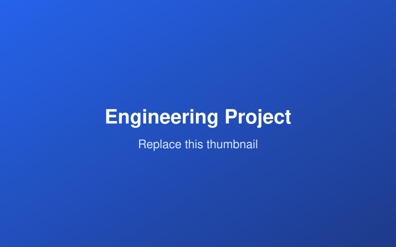

## Overview

Briefly describe the project: the problem you set out to solve, the context, and
the outcome. Two or three sentences is plenty for the top of the page.

## Role & Timeline

- **Role:** e.g. Lead developer / Team of 4
- **Timeline:** Month 20XX – Month 20XX
- **Tools:** e.g. Python, ROS, SolidWorks

## The Problem

What needed to be solved and why it was challenging.

## Approach

How you tackled it. Break this into steps or design decisions. Add figures where
helpful:

{fig-alt="Placeholder figure"}

## Results

What you achieved. Quantify outcomes where possible (performance, accuracy,
cost, time saved).

## What I Learned

A short reflection on takeaways or what you'd do differently.

## Links

- [Code / Repository](#)
- [Report / Write-up](#)
- [Demo / Video](#)
