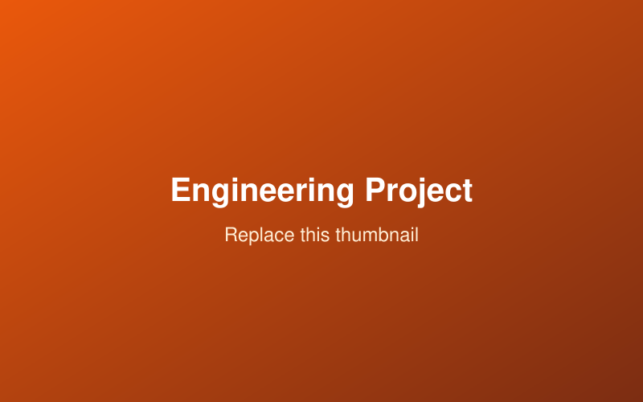

## Overview

Briefly describe the project: the problem you set out to solve, the context, and
the outcome.

## Role & Timeline

- **Role:** e.g. Lead developer / Team of 4
- **Timeline:** Month 20XX – Month 20XX
- **Tools:** e.g. MATLAB, Simulink, CFD

## The Problem

What needed to be solved and why it was challenging.

## Approach

How you tackled it. Break this into steps or design decisions.

{fig-alt="Placeholder figure"}

## Results

What you achieved. Quantify outcomes where possible.

## What I Learned

A short reflection on takeaways.

## Links

- [Code / Repository](#)
- [Report / Write-up](#)
- [Demo / Video](#)
