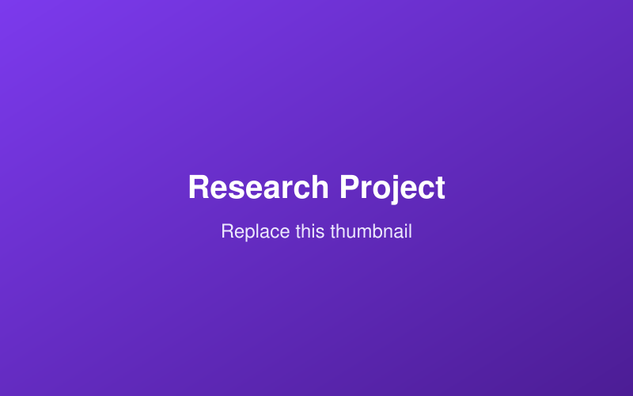

## Abstract

A short abstract-style summary of the research: the question, your method, and
the key finding.

## Motivation & Research Question

Why this problem matters and the specific question you investigated.

## Methods

Describe your experimental or computational approach, datasets, and tools.

{fig-alt="Placeholder figure"}

## Key Findings

- Finding one.
- Finding two.
- Finding three.

## Status & Collaborators

- **Status:** e.g. Ongoing / Under review / Published
- **Advisor / PI:** Name
- **Collaborators:** Names or lab

## Links

- [Paper / Preprint](#)
- [Code / Data](#)
- [Poster / Slides](#)
